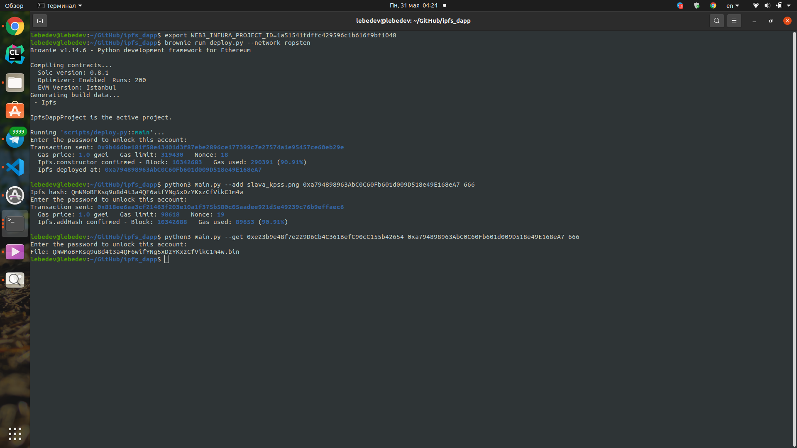

# ipfs-dapp

## Описание проекта
Децентрализованное приложение, которое:
- принимает от пользователя бинарный файл (например, PNG)  и загружает его в IPFS (в свою ноду)
- хеш загруженного файла отправляет на хранение в смарт-контракт, хранящий mapping (address => ipfs_hash)
- по запросу, получает ipfs_hash из контракта (используя текущий адрес), достает его из IPFS и ложит содержимое в корневую папку

## Сборка

Собирать проект не надо, достаточно клонировать данный репозиторий. Однако перед запуском необходимо выполнить шаги, указанные ниже.

### Установка ganache-cli (пропустите этот шаг, если уже установлено)

Удостоверьтесь, что вы имеете Node.js (>= v8) установленным.

Используя npm:

```Bash
npm install -g ganache-cli
```

### Установка brownie (пропустите этот шаг, если уже установлено)

Удостоверьтесь, что вы имеете python3 (>= 3.6) установленным.

Используя pipx:

```bash
python3 -m pip install --user pipx
python3 -m pipx ensurepath
pipx install eth-brownie
```

### Установка go-ipfs (пропустите этот шаг, если уже установлено)

https://dist.ipfs.io/#go-ipfs

### Запуск ipfs-ноды

```bash
ipfs init
ipfs daemon
```

## Запуск

Ниже описана последовательность действий, необходимая для выполнения функций приложения

### Деплой контракта

Перед деплоем в файле deploy.py необходимо изменить параметр `666` в строке `acct = accounts.load('666')` на id аккаунта, с которого вы собираетесь деплоить данный контракт.

Выполните команду:
```bash
export WEB3_INFURA_PROJECT_ID=1a51541fdffc429596c1b616f9bf1048
```

После чего выполните команду:
```bash
brownie run deploy.py --network ropsten
```

При желании можно указать любую тествоую сеть вместо параметра `--network ropsten`

В случае успеха, на экране отобразится адрес задеплоенного контракта в тестовой сети, его необходимо запомнить.

### Добавление в ipfs

Данная функция принимает от пользователя бинарный файл (например, PNG)  и загружает его в IPFS (в свою ноду), а хеш загруженного файла отправляет на хранение в контракт `Ipfs.sol`

Для запуска функции наберите:
```bash
python3 main.py --add <путь к файлу> <адрес контракта> <id аккаунта>
```
Пример запуска:
```bash
python3 main.py --add slava_kpss.png 0x8dd10Bc8D92ef3485F0d1654293808b254B56672 666
```

### Получение из ipfs

Данная функция получает ipfs_hash из контракта по адресу, достает его из IPFS и ложит содержимое файла в корневую папку

Для запуска функции наберите:
```bash
python3 main.py --get <адрес по которому был добавлен файл в контракт> <адрес контракта> <id аккаунта> 
```
Пример запуска:
```bash
python3 main.py --get 0xe23b9e48f7e229D6Cb4C361BefC90cC155b42654 0x8dd10Bc8D92ef3485F0d1654293808b254B56672 666
```

### Пример работы программы

